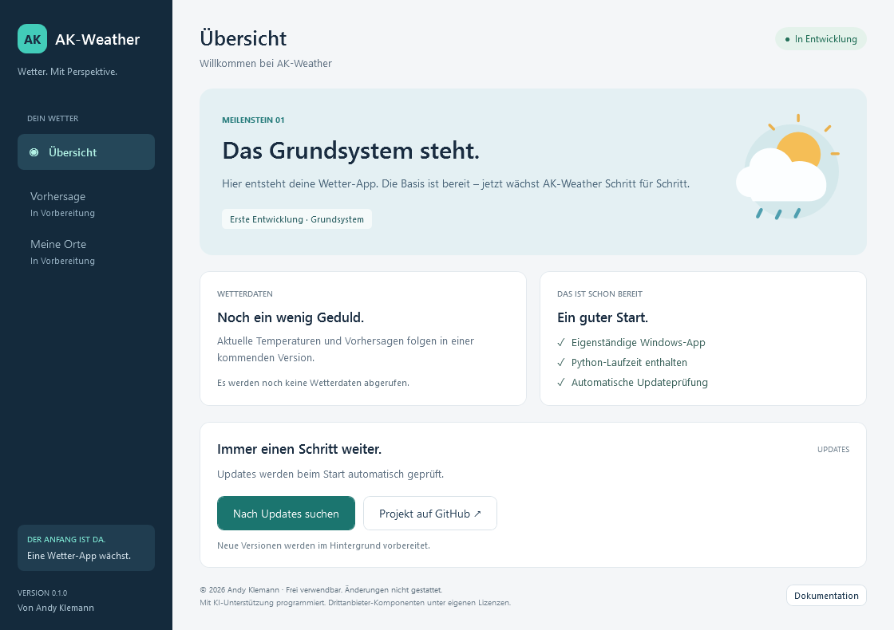

# AK-Weather

**Deine Wetter-App. Schritt für Schritt.**

AK-Weather ist eine kostenlose Windows-Wetter-App von **Andy Klemann**, die sich in Entwicklung befindet. Diese erste Version zeigt das **Grundsystem**: eine grafische Oberfläche, eine bereits enthaltene Python-Laufzeit und automatische Updates direkt über GitHub. Wetterdaten und Vorhersagen folgen in späteren Versionen.

## Herunterladen und starten

1. [Das vollständige Startpaket vom Branch `live` herunterladen](https://github.com/Contralto0/AK-Weather/archive/refs/heads/live.zip).
2. Das ZIP vollständig in einen beschreibbaren Ordner entpacken, beispielsweise `Dokumente\AK-Weather`. Nicht direkt im ZIP starten.
3. **`AK-Weather.exe`** öffnen. Bei ausgeblendeten Dateiendungen heißt die Startdatei **AK-Weather**.

Die Datei `AK-Weather.exe` und der Ordner `payload` müssen zusammenbleiben. Python, zusätzliche Pakete oder ein lokaler Server müssen nicht installiert werden. Benötigt wird **Windows 10/11, 64 Bit (x64)** mit dem Windows-Bestandteil **.NET Framework 4.8**. Die Anwendung selbst ist portabel und benötigt keine Administratorrechte. Die eigenen EXE-Dateien sind derzeit nicht digital signiert.

## Was bereits funktioniert

| Bestandteil | Stand |
| --- | --- |
| Grafische Windows-Oberfläche | Grundsystem 0.1.0 |
| Python | 3.13.15, vollständig mitgelieferte eingebettete Laufzeit |
| Updateprüfung | Automatisch nach dem Öffnen, zusätzlich per Schaltfläche |
| Updates | Nur neue oder geänderte Dateien vom Branch `live` |
| Ausfallschutz | Prüfung vor Aktivierung, bisherige Version bleibt erhalten |
| Wetterdaten, Orte und Vorhersagen | Noch in Entwicklung |

## Vorbereiteter DWD-POI-Import

Die Auslieferung enthält einen noch nicht an die Oberfläche angebundenen Baustein für den **beobachteten aktuellen Wetterzustand** einer ausdrücklich gewählten POI-Station, etwa Regen oder Nebel. Er ist keine Vorhersage und ruft beim Programmstart keine Wetterdaten ab.

## So kommen Updates an

Beim Start wird der aktuelle Commit des Branches **`live`** ermittelt. Der Updater vergleicht Dateigrößen und SHA-256-Prüfsummen und lädt ausschließlich geänderte oder neue Programmdateien. Unveränderte Dateien werden lokal übernommen. **Der Updater verwendet weder GitHub Releases noch vollständige Repository-Archive.** Das ZIP oben wird nur für den ersten Download oder eine manuelle Neuinstallation benötigt.

Ein Update wird in einem separaten Ordner vorbereitet, auf Vollständigkeit geprüft und beim nächsten Start verwendet. Über **„Jetzt neu starten“** kann es sofort geöffnet werden. Ohne Verbindung startet die vorhandene App weiter.

## Dokumentation

- [Benutzerhandbuch und Fehlerhilfe](docs/BENUTZERHANDBUCH.md)
- [Aufbau, Updateverfahren und Veröffentlichung](docs/TECHNIK.md)
- [Versionsverlauf](CHANGELOG.md)
- [Nutzungsbedingungen](LICENSE.md)
- [Drittanbieter und Python-Lizenz](THIRD_PARTY_NOTICES.md)
- [Sicherheit und Datenschutz](SECURITY.md)

## Autor und Nutzung

**Autor: Andy Klemann.** Das Programm darf kostenlos privat und gewerblich verwendet sowie unverändert weitergegeben werden. Änderungen am Programm sind nicht gestattet; maßgeblich sind die [Nutzungsbedingungen](LICENSE.md). Für mitgelieferte Drittanbieter-Komponenten gelten deren eigene Lizenzen. AK-Weather wird als Freeware bereitgestellt, nicht unter einer Open-Source-Lizenz.

Mit KI-Unterstützung programmiert.
